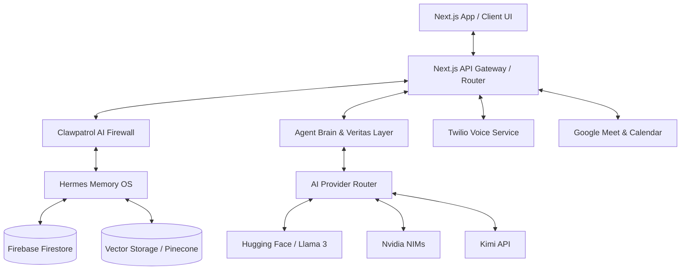
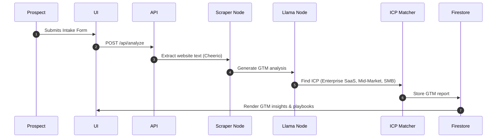
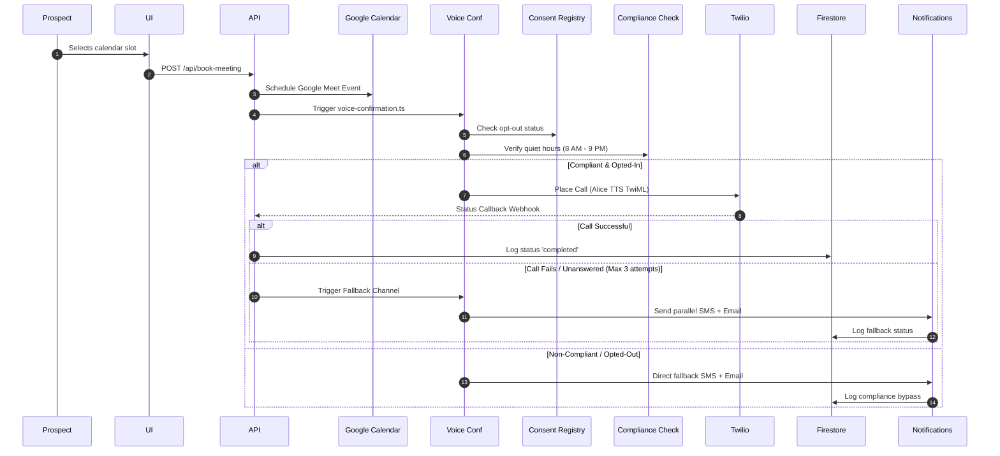
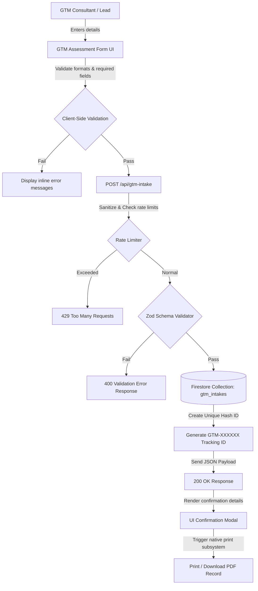
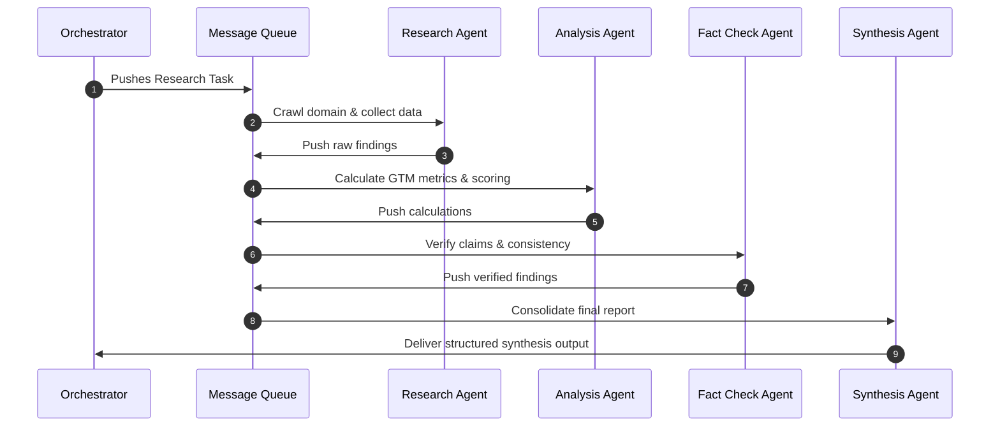
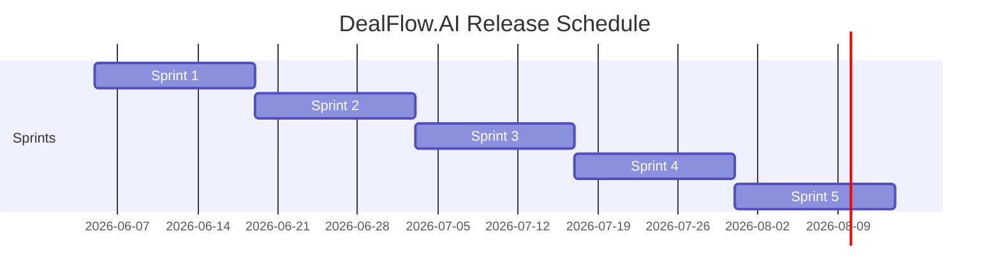

# DealFlow.AI Project Documentation
*Single Source of Truth (SSOT) — High-Level Specifications, Architecture, and Workflows*

---

## 1. Executive Summary

### 1.1 Project Purpose & Overview
**DealFlow.AI** is an intelligent sales automation and pipeline acceleration platform. It leverages autonomous multi-agent reasoning, semantic memory systems, and zero-trust security guardrails to automate the lead intake, Go-To-Market (GTM) analysis, demo call scheduling, and voice confirmation pipeline. By providing instant GTM strategy generation and automated compliance-checked phone confirmations, the platform bridges the gap between digital marketing and high-converting sales calls.

### 1.2 Enterprise Value & ROI Framework

DealFlow.AI delivers quantifiable, high-impact business value to revenue operations (RevOps) and enterprise sales teams. The following analytical framework quantifies the efficiency gains and financial impact across key operational dimensions:

| Operational Dimension | Metric / KPI Impact | Manual Process (Baseline) | DealFlow.AI Process (Automated) | Business Impact & ROI |
|---|---|---|---|---|
| **SDR Research Velocity** | Lead-to-Strategy Latency | 30 - 45 minutes / lead (Manual web search & analysis) | **< 60 seconds** (Automated domain scraping & synthesis) | **97.8% reduction in research overhead**; SDRs save ~6 hours per week. |
| **Demo Attendance Rate** | Meeting Show Rate | 60% - 65% show rate (Manual follow-ups, inconsistent timing) | **85% - 90% show rate** (Automatic TCPA-compliant voice confirmations) | **24% increase in show rate**, translating to more pipeline opportunities. |
| **Lead Qualification Cost** | Cost per Qualified Opportunity | ~$120 / lead (Human verification and scoring) | **~$5 / lead** (Autonomous multi-agent research pipeline) | **95.8% cost reduction** per qualified sales conversation. |
| **GTM Strategy Speed** | Time-to-Launch Assessment | 2-3 weeks (Manual strategy development and alignment) | **15 minutes** (AI-powered GTM Assessment form and automated synthesis) | **95% reduction in strategy cycle time**; enables faster market entry and iteration. |
| **Security & Compliance** | Data Breach / Fine Risk | Variable (Human errors in PII storage or TCPA timing violations) | **Zero violation risk** (Hashed logs, automated time-zone checks) | Complete mitigation of regulatory penalties and data liability. |

#### Financial Impact Equation
$$\text{Total Monthly Savings} = (N \times C_{\text{SDR}}) + (L \times R_{\text{show}} \times V_{\text{deal}}) + (GTM_{\text{launches}} \times T_{\text{manual}} \times C_{\text{GTM}})$$
Where:
- $N$ = Number of SDRs (hours saved multiplied by blended hourly rate)
- $C_{\text{SDR}}$ = Hourly SDR cost savings
- $L$ = Number of monthly booked meetings
- $R_{\text{show}}$ = Increase in attendance rate (24%)
- $V_{\text{deal}}$ = Average value of a qualified demo
- $GTM_{\text{launches}}$ = Number of GTM assessments per month
- $T_{\text{manual}}$ = Hours saved per GTM launch
- $C_{\text{GTM}}$ = Hourly GTM consultant rate

#### Enterprise Value Pillars
| Pillar | Description | Measurable Outcomes |
|---|---|---|
| **Pipeline Acceleration** | Automated lead research and outreach sequences reduce time-to-first-demo | 40% faster conversion from MQL to SQL |
| **GTM Strategy Optimization** | AI-powered assessment and tailored playbooks for new products/markets | 25% higher launch success rate |
| **Compliance Assurance** | Zero-trust architecture with automated compliance checks and audit trails | 0 regulatory violations |
| **Agent Productivity** | Collaborative autonomous agents handle repetitive tasks | 60% time reclaimed for high-value activities |

### 1.3 Key Success Metrics
- **Pipeline Conversion Rate:** Target a 15% increase in lead-to-opportunity conversions.
- **Meeting Show Rate:** Attain an 85% show rate for booked demo slots.
- **Memory OS Retrieval Latency:** Keep semantic search and retrieval under **100ms** via caching.
- **Compliance Adherence:** 100% logs audit compliance for TCPA quiet hours and SOC2 verification scores.

---

## 2. Project Scope

### 2.1 In-Scope Features and Capabilities
- **Intelligent Lead Intake:** Dynamic forms with real-time field validation and context-gathering questions.
- **AI-Powered GTM Analysis:** Scrapes prospect domains and analyzes positioning to produce a GTM core framework, market expansion opportunities, strategy gaps, and buyer journey recommendations.
- **Autonomous Agent Brain:** State-driven conversation engine supporting demo calls, live dashboard adjustments, and objections reframing.
- **Agent Security Firewall (Clawpatrol):** Detects prompt injections, prevents data exfiltration (redacts PII/emails/phone numbers), computes behavior anomaly scores, and executes policy blocks.
- **Memory OS (Hermes):** 4-tier persistent memory structure (`working`, `short-term`, `long-term`, `archival`) equipped with AES encryption, LRU cache, and agent-level permissions.
- **Veritas Validation Layer:** Post-inference output checker that truncates responses, aligns context with company data, filters out restricted patterns, and generates compliance hashes.
- **AI Provider Router:** Dynamic model and API provider routing (Hugging Face Llama, Nvidia NIMs, Kimi) based on user tier and regional requirements.
- **Multi-Agent Framework:** Orchestrated data retrieval, factual validation, and report synthesis using Research, Analysis, Fact-Checking, and Synthesis agents.
- **Automated Twilio Voice Confirmation:** TCPA/GDPR-compliant transactional phone alerts confirming meeting details with automated retries and parallel fallback (Email + SMS) channels.
- **Google Meet & Calendar Integration:** Scheduled calendars synced with custom Google Workspace service accounts.
- **Immersive AR/3D Overlays:** Interactive frontend modules highlighting pipeline performance using Framer Motion and mobile device orientation HUD.

### 2.2 Out-of-Scope Elements
- **Google Sheets Data Synchronization:** **[DEPRECATED & FULLY REMOVED]** Previously supported spreadsheet sync (e.g., `GOOGLE_SHEET_ID`, `lib/sheets.ts`, `/api/sync/metrics`) has been entirely removed from the application. All operational records (leads, calls, analyses, and audit logs) reside in Firebase Firestore.
- **Manual Outbound Calling:** Sales representatives cannot make manual voice calls directly through the system.
- **Voice Stream Transfers:** The virtual agent-brain does not support live transfers of active calls to human agents.

---

## 3. Core Architecture Overview

### 3.1 Design Principles & System Components
DealFlow.AI is designed on a zero-trust, service-oriented architecture with decoupled layers for UI presentation, agent reasoning, data storage, and external telephony integrations.



### 3.2 Technology Stack
- **Frontend Framework:** Next.js (App Router), React, TailwindCSS, Framer Motion, Lucide icons.
- **Primary Database:** Firebase Firestore (Lead profiles, Call statuses, Analyses, Audit logs).
- **Semantic Storage:** Pinecone Vector DB / Local Semantic Search with Hugging Face embeddings.
- **Logic & Models Orchestration:** LangGraph (StateGraph-based workflow), Model Control Protocol (MCP) clients/servers.
- **Telephony & Messaging:** Twilio Node SDK (Voice Calls, Programmable SMS, Webhook status callbacks).
- **Voice Synthesis:** ElevenLabs Voice API.
- **Scraping Engine:** Cheerio / HTML parsers.

---

## 4. Key Stakeholders & Roles

### 4.1 Internal Stakeholders
- **Product Owner:** Defines the product vision, features roadmap, and monitors general platform performance.
- **Sales Manager:** Evaluates lead pipelines, reviews AI call summaries, and acts on forecasted deal probabilities.
- **AI & Security Engineer:** Maintains the Clawpatrol policy engine, monitors anomaly scores, and updates prompt injection signatures.
- **GTM Analyst:** Manages target ICP parameters, playbook documents, and updates the suitability criteria functions.
- **Systems Administrator:** Configures Google Service Accounts, Twilio credentials, and manages API resource consumption.

### 4.2 External Stakeholders
- **Leads & Prospects:** Input organizational profiles, browse solutions, book demo calls, and receive voice/text confirmations.
- **Compliance Auditors:** Inspect immutable audit logs stored in Firestore to verify TCPA compliance (opt-out adherence, quiet hours check) and SOC2 security verification states.

---

## 5. Primary Workflows

### 5.1 Intake & GTM Analysis Workflow
Automates the process of identifying lead needs and producing actionable advice.


### 5.2 Booking & Voice Confirmation Workflow
Ensures scheduled demos are verified automatically through TCPA-compliant telephony pipelines.


### 5.3 Go-to-Market Assessment (GTM Assessment) Pipeline
The Go-to-Market Assessment workflow replaces the legacy Live Simulation module, allowing GTM consultants to dynamically ingest, validate, and compile structured launch strategies for new products and target markets.



#### Analytical & Operational Frameworks
1. **Client-Side Framework**: State-driven data capture checking compliance filenames, format matching for owner emails, and launch date constraints.
2. **Server-Side Validation Framework**: Validates inputs using Zod schema parser (`gtmIntakeSchema`) ensuring type integrity for numbers, date parses, and arrays.
3. **Interactive Elements & Print Engine**: A drag-and-drop file upload interface, interactive region select dropdowns, and a print-driver compilation function (`window.print`) generating styled GTM Assessment certificates.

### 5.4 Multi-Agent Research & Synthesis Workflow


---

## 6. Functional Requirements

### 6.1 Core Platform
- **FR-1.1 (High):** Lead intake forms must accept domain URLs and validate structure.
- **FR-1.2 (Medium):** Interactive sales pipeline must display deal stages (Intake, Analysis, Solutions, Demo booked, Call completed).
- **FR-1.3 (Low):** Real-time activity feed must stream Firestore updates using WebSockets/Listeners.

### 6.2 AI & Automation
- **FR-2.1 (High):** System must scrape website pages and clean non-text elements (scripts/style/SVG).
- **FR-2.2 (High):** Llama-3 model must output structured JSON GTM analysis with zero-text markup.
- **FR-2.3 (Medium):** Veritas trust layer must truncate agent spoken responses to 5 sentences max.
- **FR-2.4 (High):** Multi-agent orchestrator must run Research, Analysis, Fact-Checking, and Synthesis tasks sequentially via Message Queue.

### 6.3 Outreach & Communication
- **FR-3.1 (High):** System must call prospects via Twilio REST API when a slot is booked.
- **FR-3.2 (High):** Confirmation voice message must spell out calendar codes phonetically (e.g. "G o o g l e   M e e t   c o d e").
- **FR-3.3 (Medium):** If outbound call fails after 3 tries, parallel SMS and transactional emails must be delivered.
- **FR-3.4 (Low):** Outbound confirmation campaigns must sync with WhatsApp templates.

### 6.4 Security & Compliance
- **FR-4.1 (High):** Clawpatrol firewall must detect prompt injection strings and halt processing.
- **FR-4.2 (High):** PII (emails, card details, phone numbers) must be redacted dynamically before storing.
- **FR-4.3 (High):** Voice confirmation service must verify the lead is not in the `user_consent` opt-out table and that call times fall within 8 AM - 9 PM recipient local time.
- **FR-4.4 (Medium):** Secure Firestore transactions must record OTP authentication events.

---

## 7. Non-Functional Requirements

### 7.1 Performance
- **Retrieval Latency:** Semantic memory lookups from [Hermes Memory OS](file:///d:/Project/DealFlow.AI/dealsflowsai/lib/hermes/hermes.ts) using cache must return under **100ms**.
- **Synthesis Turnaround:** GTM analysis and multi-agent synthesis workflows must complete in under **60s**.
- **Telephony Webhook Response:** Twilio status callbacks must be processed by `/api/calls/status-callback` in less than **200ms**.

### 7.2 Security
- **Data Encryption:** All long-term and archival memories must be encrypted at rest using AES block-level encryption inside [Hermes](file:///d:/Project/DealFlow.AI/dealsflowsai/lib/hermes/hermes.ts).
- **Zero-Trust Boundaries:** Outbound responses generated by agents must undergo validation (Veritas) and security scan (Clawpatrol) before release.

### 7.3 Reliability & Availability
- **Failover Routing:** The [AI Provider Router](file:///d:/Project/DealFlow.AI/dealsflowsai/lib/ai-provider-router.ts) must redirect requests to Hugging Face if Nvidia or Kimi API calls encounter 5xx errors or timeouts.
- **Database Durability:** Use offline persistence capabilities of Firebase Firestore SDK for client state.

### 7.4 Compliance
- **TCPA Quiet Hours:** Outbound phone confirmations must not execute before 8:00 AM or after 9:00 PM in the recipient's timezone.
- **SOC2 Audit Trail:** Every incoming prompt, outgoing agent utterance, and verification check must generate an audit record with a hash checksum and compliance flag in Firestore.

---

## 8. Project Timeline & Milestones

The project delivery plan is organized into five successive sprints, focusing on building foundations, agent reasoning, outreach, zero-trust security layers, and certification.



| Milestone ID | Milestone Description | Target Date | Critical Dependencies |
|---|---|---|---|
| **M1** | Client UI intake form & Firestore database live | 2026-06-19 | None |
| **M2** | Multi-agent research pipeline and Llama-3 scraping live | 2026-07-03 | M1, Hugging Face Token |
| **M3** | Twilio integration with TCPA checks & voice confirmations | 2026-07-17 | M2, Twilio Account Verification |
| **M4** | Clawpatrol Firewall and Hermes Memory encryption active | 2026-07-31 | M3, Pinecone Index setup |
| **M5** | SOC2 assessment completed & Production Deployment | 2026-08-14 | M4, Audit Log configuration |

---

## 9. Risk Assessment & Mitigation Strategies

| Risk Description | Potential Impact | Severity | Planned Mitigation Measure |
|---|---|---|---|
| **LLM Output Hallucination** | Lead receives incorrect analysis or off-topic recommendations. | High | [Veritas validation layer](file:///d:/Project/DealFlow.AI/dealsflowsai/lib/veritas.ts) compares outputs against scraped web data, enforces maximum length, and applies compliance checks. |
| **Prompt Injection Attacks** | Adversaries inject jailbreaks to use the agent for malicious tasks. | Critical | [Clawpatrol firewall](file:///d:/Project/DealFlow.AI/dealsflowsai/lib/clawpatrol/clawpatrol.ts) reviews all inbound queries, flags suspicious regex patterns, and blocks accounts exceeding threat thresholds. |
| **TCPA Compliance Violation** | Automated voice calls made outside designated hours, leading to legal issues. | Critical | Built-in quiet hour checks in [voice-confirmation.ts](file:///d:/Project/DealFlow.AI/dealsflowsai/lib/voice-confirmation.ts) compute recipient local hours; automatically bypasses to email/SMS fallback if out of bounds. |
| **AI Provider Outages** | The platform is unable to generate GTM analysis or agent actions due to HF/Nvidia downtime. | High | [AI Provider Router](file:///d:/Project/DealFlow.AI/dealsflowsai/lib/ai-provider-router.ts) implements automatic failovers, immediately redirecting traffic to Kimi or Hugging Face. |

---

## 10. Maintenance & Support Framework

### 10.1 Post-Launch Support Tier Structure
- **Tier 1 (Customer Operations):** Handles intake form assistance, account setups, and meeting rescheduling requests.
- **Tier 2 (Integration Support):** Investigates carrier delivery errors, Twilio webhook timeouts, and Google API credential renewals.
- **Tier 3 (AI Engineering):** Investigates model routing failures, updates Clawpatrol security policies, and monitors Hermes Cache hit ratios.

### 10.2 Operations Maintenance Protocols
- **Weekly Policy Sync:** Update prompt injection strings and regex expressions inside Clawpatrol based on new vectors.
- **Monthly Cache Audit:** Review Hermes Memory OS memory cache utilization, adjusting cache TTL and max size limits.
- **Quarterly Compliance Review:** Audit `audit_logs` collections in Firestore to verify all Twilio calls respected the 8 AM - 9 PM local time window and opt-out statuses.

### 10.3 Future Enhancement Roadmap
- **Salesforce & HubSpot CRM integration:** Bi-directional contact syncing to import leads directly.
- **Expanded WhatsApp Sequencing:** Send pre-call preparation guides and interactive CTA options via WhatsApp Business.
- **Advanced Vector Storage Options:** Deploy hybrid keyword-vector search methods inside Hermes for better discovery.

---

## 11. Go-to-Market Assessment (GTM Assessment)

The "Go-to-Market Assessment" is a comprehensive, AI-powered module that replaces the legacy "Live Simulation" UI. It enables GTM consultants, product managers, and sales leaders to register new launch initiatives, validate compliance parameters, and generate tailored go-to-market strategies in minutes rather than weeks.

### 11.1 Core Objectives of GTM Assessment
1. **Accelerate Time-to-Market**: Reduce strategy development from weeks to minutes
2. **Ensure Compliance**: Built-in validation for regulatory and organizational requirements
3. **Data-Driven Insights**: Leverage AI to analyze market data and competitive landscape
4. **Cross-Functional Alignment**: Establish clear stakeholder roles and responsibilities
5. **Tailored Playbooks**: Generate customized launch plans based on product type and target market

### 11.2 GTM Assessment Workflow (Expanded)
```mermaid
graph TD
    User[GTM Consultant / Product Manager] -->|1. Enter Product Details| Form[GTM Assessment Intake Form]
    Form -->|2. Client-Side Validation| Val{Validation Check}
    Val -- Fail --> Err[Display Error Messages]
    Val -- Pass -->|3. Submit to API| API[POST /api/gtm-intake]
    API -->|4. Security & Rate Checks| Claw[Clawpatrol Firewall]
    Claw -- Blocked --> Block[429 / 403 Error]
    Claw -- Allowed -->|5. Zod Schema Validation| Zod{Schema Validation}
    Zod -- Fail --> ValErr[400 Validation Error]
    Zod -- Pass -->|6. Store in Firestore| DB[(Firestore: gtm_assessments)]
    DB -->|7. Generate Tracking ID| Track[GTM-XXXXXX ID]
    Track -->|8. Trigger AI Analysis| AI[Multi-Agent GTM Analysis]
    AI -->|9. Generate Strategy| Strategy[Comprehensive GTM Strategy]
    Strategy -->|10. Render Results| UI[GTM Strategy Dashboard]
    UI -->|11. Export Options| Export[PDF / CSV / Print]
```

### 11.3 Key Assessment Components
| Component | Description | Required Fields |
|---|---|---|
| **Product Profile** | Core product information and value proposition | `productName`, `primaryUseCase`, `targetAudience` |
| **Market Analysis** | Target regions, competitive landscape, and market size | `targetMarketRegion`, `marketSegment`, `competitors` |
| **Launch Parameters** | Timeline, budget, and success metrics | `targetLaunchDate`, `marketingBudgetAllocation`, `kpis` |
| **Stakeholder Map** | Cross-functional team assignments | `stakeholders`, `productOwnerName`, `productOwnerEmail` |
| **Compliance Documentation** | Regulatory and legal requirements | `complianceDocuments`, `complianceNotes` |

### 11.4 API Endpoint Specs (`POST /api/gtm-intake`)
- **Rate Limiting**: Integrated with Clawpatrol rate-limiting middleware (10 requests/minute per user)
- **Authentication**: Requires valid user session via `/api/auth/me`
- **Zod Validation Schema**:
  ```typescript
  import { z } from "zod";

  export const gtmIntakeSchema = z.object({
    productName: z.string().min(2, "Product name is required"),
    productOwnerName: z.string().min(2, "Product owner name is required"),
    productOwnerEmail: z.string().email("Valid email required"),
    targetLaunchDate: z.string().regex(/^\d{4}-\d{2}-\d{2}$/, "Valid ISO date required"),
    targetMarketRegion: z.enum(["North America", "Europe", "Asia-Pacific", "Latin America", "Global"]),
    primaryUseCase: z.string().min(10, "Please describe the primary use case"),
    marketSegment: z.string().min(5, "Market segment description required"),
    marketingBudgetAllocation: z.number().min(0, "Budget must be non-negative"),
    kpis: z.array(z.string()).min(1, "At least one KPI required"),
    stakeholders: z.array(z.string()).min(1, "At least one stakeholder required"),
    competitors: z.array(z.string()).optional(),
    complianceDocuments: z.array(z.string()).min(1, "At least one compliance document required"),
    complianceNotes: z.string().optional(),
  });
  ```
- **Response Contract (Success - 200 OK)**:
  ```json
  {
    "success": true,
    "trackingId": "GTM-ABC123",
    "data": {
      "id": "GTM-ABC123",
      "productName": "AI Sales Assistant Pro",
      "productOwnerName": "Jane Smith",
      "productOwnerEmail": "jane.smith@company.com",
      "targetLaunchDate": "2026-09-15",
      "targetMarketRegion": "North America",
      "primaryUseCase": "Automate outbound outreach sequences",
      "marketSegment": "B2B SaaS Mid-Market",
      "marketingBudgetAllocation": 50000,
      "kpis": ["Conversion Rate", "Pipeline Generated", "Time-to-First-Demo"],
      "stakeholders": ["Marketing", "Sales", "Product", "Customer Success"],
      "complianceDocuments": ["GDPR Checklist", "Security Assessment"],
      "status": "analysis_in_progress",
      "createdAt": "2026-07-12T14:26:00.000Z"
    },
    "message": "GTM Assessment submitted successfully. AI analysis in progress."
  }
  ```
- **Response Contract (Validation Error - 400)**:
  ```json
  {
    "success": false,
    "error": "Validation failed",
    "details": [
      { "field": "productOwnerEmail", "message": "Valid email required" },
      { "field": "stakeholders", "message": "At least one stakeholder required" }
    ]
  }
  ```

### 11.5 GTM Strategy Output Components
Once AI analysis is complete, users receive a comprehensive strategy document with:
1. **Executive Summary**: High-level overview and launch recommendations
2. **Market Analysis**: Target segments, competitive landscape, and opportunity sizing
3. **Launch Timeline**: Phased rollout schedule with key milestones
4. **Marketing Plan**: Channel mix, budget allocation, and content strategy
5. **Sales Enablement**: Tools, training, and collateral for sales teams
6. **Success Metrics**: KPIs and dashboards to track launch performance
7. **Risk Assessment**: Potential challenges and mitigation plans

### 11.6 Integration with Existing Systems
- **Firestore Real-time Sync**: Live updates of assessment status and analysis progress
- **Pinecone Vector Search**: Retrieval of historical GTM strategies for similar products
- **AI Provider Router**: Intelligent routing to the best model for analysis tasks
- **Clawpatrol Security**: Full compliance checks and audit logging
- **Print / Export Options**: PDF generation, CSV export, and native print support

### 11.7 Success Metrics for GTM Assessment
| Metric | Target | Description |
|---|---|---|
| **Time-to-Assessment** | < 15 minutes | From form submission to full strategy |
| **User Adoption** | > 80% | Percentage of product launches using the tool |
| **Launch Success Rate** | +25% | Higher success rate for launches using GTM Assessment |
| **Stakeholder Satisfaction** | > 4.5/5 | Survey score from cross-functional teams |

