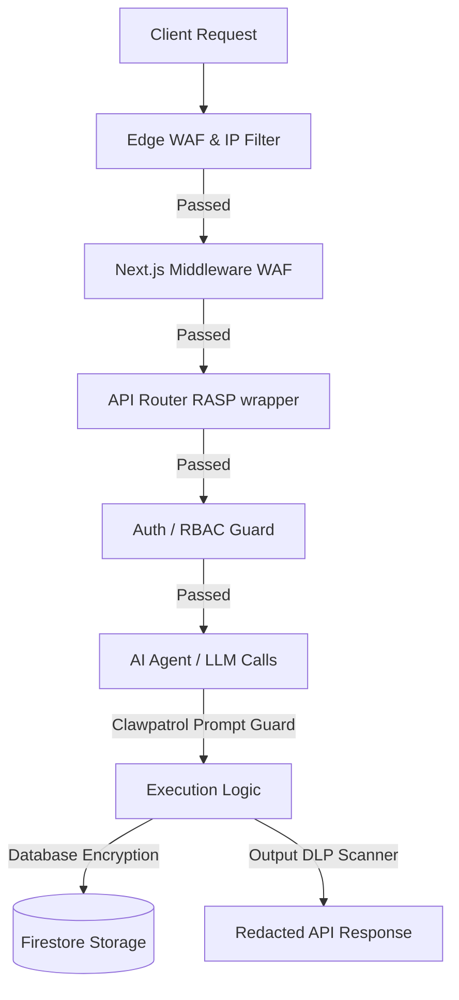

# DealFlow AI Security Runbook & Response Guide

This document details the multi-layered security architecture of the DealFlow AI platform, operational instructions for handling security events, and compliance protocols.

---

## 1. Multi-Layered Security Architecture

Our security strategy operates on a **defense-in-depth** model:

### Infrastructure Layer (Edge/Network)
- **Edge WAF & IP Filtering:** Restricts malicious IPs and filters traffic at the cloud edge level.
- **Next.js Middleware WAF:** edge-safe inspection of URL parameters, query strings, headers, and request bodies for standard SQLi, XSS, and Path Traversal strings.

### Application Layer (Codebase)
- **Runtime Application Self-Protection (RASP):** The API wrapper function `withSecurityFirewall` intercepts routing, performs in-depth input validation, rate limiting checks, and security audits.
- **Data Leakage Prevention (DLP):** Dynamic scans of API JSON outputs that redact SSNs, Credit Cards, email addresses, phone numbers, and private keys unless bypassed by an authenticated administrator.
- **Prompt Injection Prevention (Clawpatrol):** Analyzes multi-agent communication streams for instructions override, jailbreaking attempts, and template escaping.

### Data Layer (Database)
- **Symmetric Encryption (AES-256-GCM):** PII contact fields (phone numbers, email addresses) are encrypted using a 256-bit key before storage, ensuring data-at-rest protection.
- **GDPR IP Hashing:** All logged IP addresses are hashed using SHA-256 combined with a unique salt. Raw IPs are never written to audit tables.

---

## 2. Incident Response Runbook

### Incident Level 1: Security Anomaly/Trigger (Medium Severity)
*Example: Clawpatrol logs repeated blocked prompt injection attempts or IP exceeds rate limits.*
1. **Detection:** Check Firestore collection `audit_logs` or the SIEM dashboard.
2. **Analysis:** Identify the source IP, target endpoint, and matched patterns.
3. **Containment:** If a single IP is repeatedly triggered, append it to the `BLOCKED_IPS` environment variable list.
4. **Remediation:** Adjust Clawpatrol/WAF regex rules if the trigger is identified as a false positive.

### Incident Level 2: Confirmed Breach or Data Leak (Critical Severity)
*Example: Unredacted PII is exposed to unauthorized accounts or abnormal query execution suggests database compromise.*
1. **Immediate Lockdown:** Disable vulnerable API routes or place the application in maintenance mode.
2. **Rotate Secrets:** Follow the secret rotation guide (Section 3).
3. **Forensic Analysis:** Extract audit logs and inspect Firestore document accesses. Verify audit log integrity using `Clawpatrol.verifyAuditLogIntegrity()`.
4. **GDPR Notification:** If PII is compromised, notify the Supervisory Authority within **72 hours** and contact affected users immediately.

---

## 3. Secret & Key Rotation Guide

### Rotating Encryption Keys (AES)
PII data encryption is bound to `LLM_API_KEY_ENCRYPTION_KEY`.
1. Deploy a script that decrypts existing leads using the old key, and encrypts them using the new key.
2. Update the environment variables with the new `LLM_API_KEY_ENCRYPTION_KEY` hex value.
3. Remove old keys from environment storage.

### Rotating JWT Secrets
1. Generate a new cryptographically secure string (e.g. 64-character hex).
2. Set `JWT_SECRET` in environment variables.
3. Users will be automatically logged out and asked to sign-in again, issuing fresh tokens signed with the new secret.

---

## 4. Maintenance & Audit Schedule

| Task | Target Frequency | Responsible Party |
|---|---|---|
| Dependency Vulnerability Scan (`npm audit`) | Weekly | CI/CD Automated Workflow |
| WAF Regex & Signature Reviews | Monthly | App Security Team |
| Penetration & Fuzz Testing | Bi-Annually | External Auditor / DevSecOps |
| Secret and Salt Rotation | Annually | Security Administrator |
